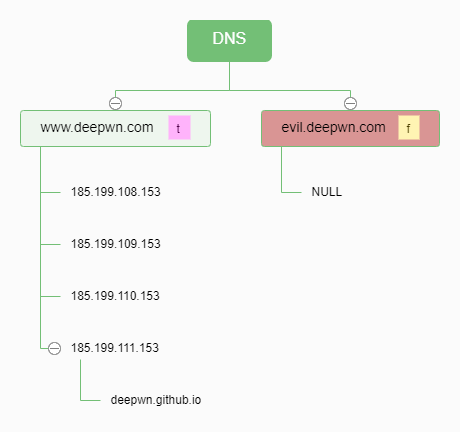
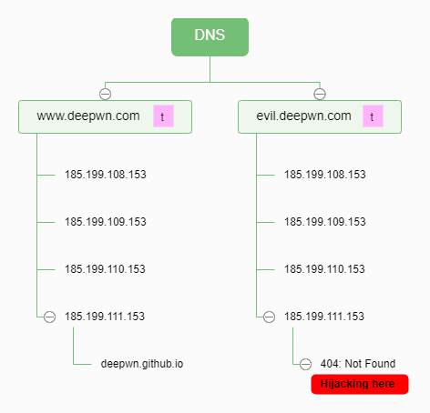
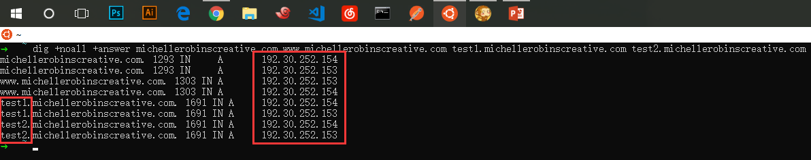
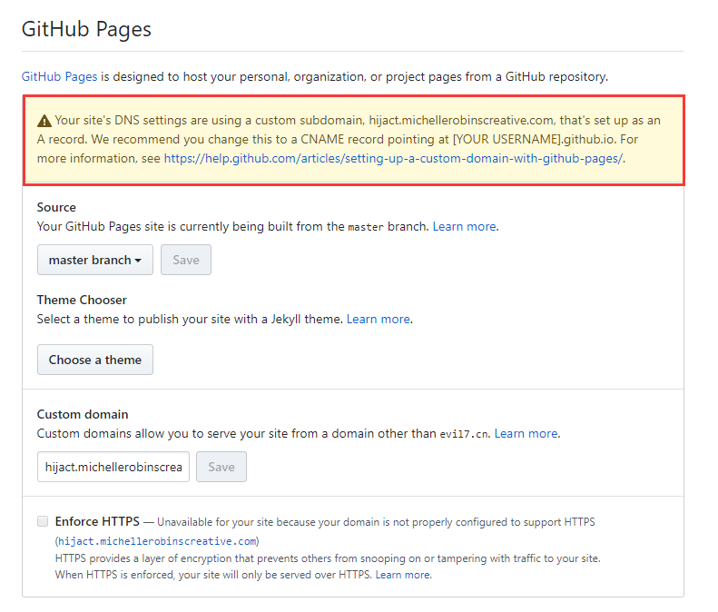
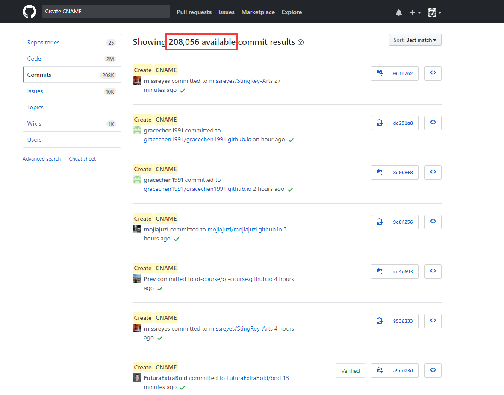
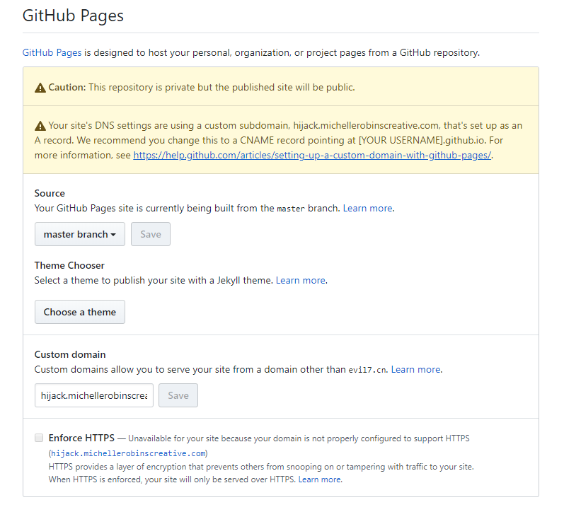
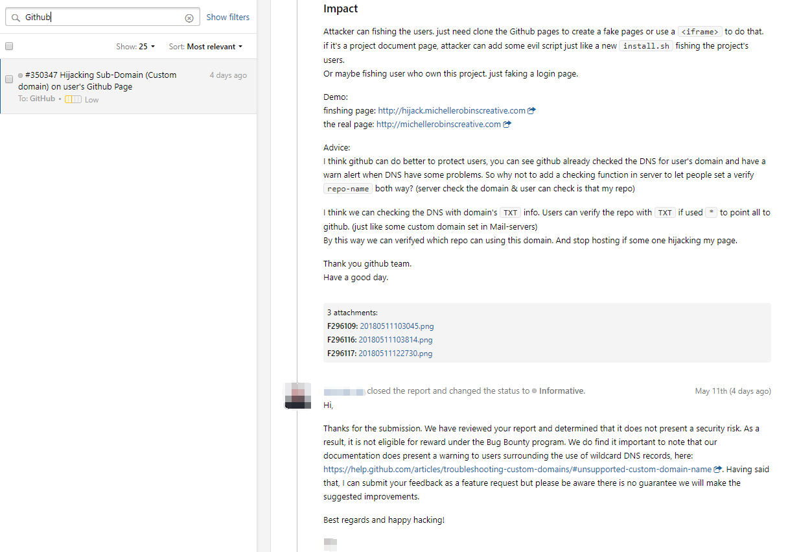

# GitPageHijack


OK now. Let's hijack github user's custom domain.

And I cearted this repo for quick checking with this idea.

## Find the weakness

Some days early I found an odd on github.

If users used wildcard DNS records to GitHub Pages.

That will let anyone can hijacking others user's sub-domain.

just like demo: <http://hijack.michellerobinscreative.com>

## Why this will happend

If an alone DNS records `www.deepwn.com => GitHub Page`:



If a wildcard DNS records `*.deepwn.com => GitHub Page`:



You can see. if a wildcard DNS records point to GitHub Page servers. you can ask for any sub-domain and answers all point to GitHub.

But, not only you can hosting on GitHub that anybody can do it.

So. If we do found a wildcard DNS records of custom domain in GitHub then we can do hijacking now.





## How many custom domains in GitHub

You can see that's a lot lot lot lot of commits about domains



## How many vulnerable

Just testing with `run.sh` to get limit 1 day's data we can found 11 vulnerables. OMG :(

2018-05-14 (day: 13--14)

```
11894565848c26.erisesoft.com
bevis.me
devcode.work
httpforge.aspyct.org
ingy.pyrl.org
mail.aulos.org
old.qore.org
owncloud.seagl.org
server.asymptopia.org
shitcoindeluxe.org
sky.max.pub
```

## Advice:

GitHub already checked the DNS for user's domain when it put in settings.

And see we already have waring alert if problems about DNS or domain.



So why don't let peoples set a verify repo-name or username org-name in 'TXT' records? (can add a TXT but not must do)

Then server go check the DNS if a wildcard only should host for one username. just like some custom domain set in Mail-servers, used 'TXT' to verify the mail domain.

By this way we can contorl which repo can using this sub-domain and stop hosting if some one hijacking my page.

## At last

I had to report this to GitHub Security Bug Bounty. And write down this for you to tell you what kind of attack you maybe need face to.



Now we can see some "Danger Notes" in document <https://help.github.com/articles/troubleshooting-custom-domains/#unsupported-custom-domain-name>. But it's not be fixed and still none verify for this "BUG".

Now you need do attention to your settings before this be fixed.

## I open this repo to alert you

> PLEASE DON'T USE WILDCARD DNS RECORD FOR CUSTOM DOMAIN ON GITHUB !!!

> PLEASE DON'T USE WILDCARD DNS RECORD FOR CUSTOM DOMAIN ON GITHUB !!!

> PLEASE DON'T USE WILDCARD DNS RECORD FOR CUSTOM DOMAIN ON GITHUB !!!

dev with love & hack with love :)
